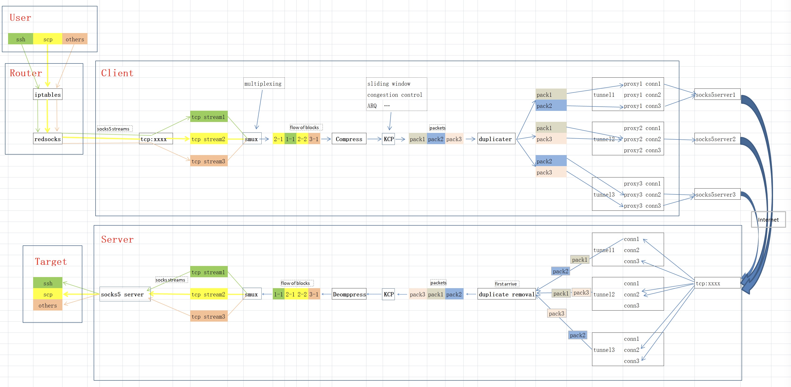

 

## Introduction
nctst是一个 TCP to TCP 点对点连接工具
来解决出海小公司连海外机房服务器太慢问题的工具。很多海外机房连接特别慢，有时候连接还会被GFW当做异常请求拦截，通常都需要借助梯子来连，但梯子又容易不稳定，要经常更新订阅甚至会跑路，导致正在连着的请求掉线，如果正在通过SSH执行耗时任务忽然断了要从头再来很难受。小公司又没有专线条件。。。

主要思路是用多个梯子实现负载均衡和防丢包，只要有一个梯子活着请求就还能到达机房，可以保证不掉线。实现细节是通过smux把多路连接变成一路，加密后通过KCP发出去，由KCP负责丢包重发等机制，为了提升响应速度，把同一个包复制多份通过不同路径发过去，server端收到第一份就可以用，然后根据包ID把后续重复的扔掉即可（不扔掉直接提交给KCP的话不会影响功能，但会导致KCP发送额外的ACK包，浪费带宽），server最后通过smux还原成对应的多个请求，发往目标服务。

透明连接：
在路由器上用iptables规则把发往海外机房内网IP段的包转发给[redsocks](https://github.com/darkk/redsocks)(原版，但因为跑在路由上，可能需要自行找对应路由的arm版本)变成socks5请求再转发到nctst就可以实现透明连接机房，不用任何多余的设置即可访问机房内所有机器的任何服务(仅限TCP)。

第一版，问题很多，忙，凑合先试试

<h3>特性：</h3>

1. 多路复用

2. 负载均衡

3. 多线路并发选取最快到达

3. 数据压缩

4. 认证加密

5. 多用户

6. 手机App生成验证码登录(iOS客户端，Flutter客户端)

<h3>后续计划支持：</h3>

1. UDP

2. 监控dashboard

3. 其它梯子协议

## Documentation

<h3>简单用法：</h3>

ssh client ---> nctst client port -------------- nctst server ---> ssh server port

相当于一个通道，中间通过多个路线并发和容灾保证连接持续性。

<h3>复杂用法：</h3>

nctst服务端后边放一个socks5服务，就可以连接任何东西了，再借助路由上配置的iptables规则和redsocks工具转发就可以实现网段内透明连接机房任何服务

server:
./server -c config.json

client:
./client -c config.json -d authcode

iptables:

iptables -t nat -I PREROUTING -p tcp -d 192.168.100.1/24 -j REDIRECT --to-ports 1082

redsocks:

redsocks {
	local_ip = 192.168.1.1;
	local_port = 1082;
    interface = br0;
	ip = 192.168.1.10;
	port = 8000;
	type = socks5;
    autoproxy = 0;
}

IP和Port等都是随手写的，具体自行google配置

感谢：

SMUX: https://github.com/xtaci/smux

KCP-GO: https://github.com/xtaci/kcp-go

SOCKS5: https://github.com/haochen233/socks5
